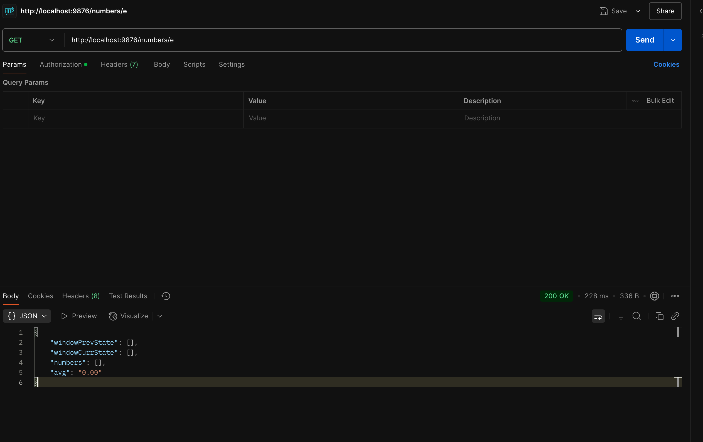

# Average Calculator Microservice

A Node.js microservice that calculates averages of different types of numbers (prime, fibonacci, even, and random) using a sliding window approach.


## Output 





## Prerequisites

- Node.js and npm
- MongoDB

## Setup Instructions

1. Clone the repository
2. Install dependencies:
   ```bash
   npm install
   ```

3. Create a `.env` file with the following content:
   ```
   PORT=9876
   MONGODB_URI=mongodb://localhost:27017/average-calculator
   ```

4. Start MongoDB service

5. Start the server:
   ```bash
   npm run dev
   ```

## API Endpoints

### GET /numbers/{numberId}

Fetches numbers of the specified type and calculates their average.

Valid numberId values:
- `p`: Prime numbers
- `f`: Fibonacci numbers
- `e`: Even numbers
- `r`: Random numbers

Example response:
```json
{
   "windowPrevState": [],
   "windowCurrState": [2, 4, 6, 8],
   "numbers": [2, 4, 6, 8],
   "avg": 5.00
}
```

## Features

- Sliding window of size 10
- Deduplication of numbers
- Timeout handling (500ms)
- MongoDB persistence
- Error handling
- CORS enabled

## Test Server APIs Used

The service integrates with the following test server APIs:

1. Prime Numbers: http://20.244.56.144/evaluation-service/primes
2. Fibonacci Numbers: http://20.244.56.144/evaluation-service/fibo
3. Even Numbers: http://20.244.56.144/evaluation-service/even
4. Random Numbers: http://20.244.56.144/evaluation-service/rand
